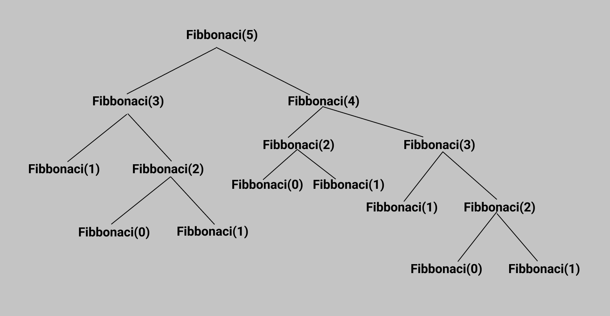

# Fibonacci in Golang
## Fibonacci is the series of numbers :
```
0,1,1,2,3,5,8,13,21,34,.....
```

So the definition is a series of numbers in which each number is the sum of the two that precede it.

## Fibonacci Series in Golang:

**1. Recursive**

*ex fibonacci(5)*


- Using formula return fibonacci(n-2) + fibonacci (n-1)


**2. Iterative**

- Using for loop to find fibonacci


**3. Memoization**

- Using array to find fibonacci
